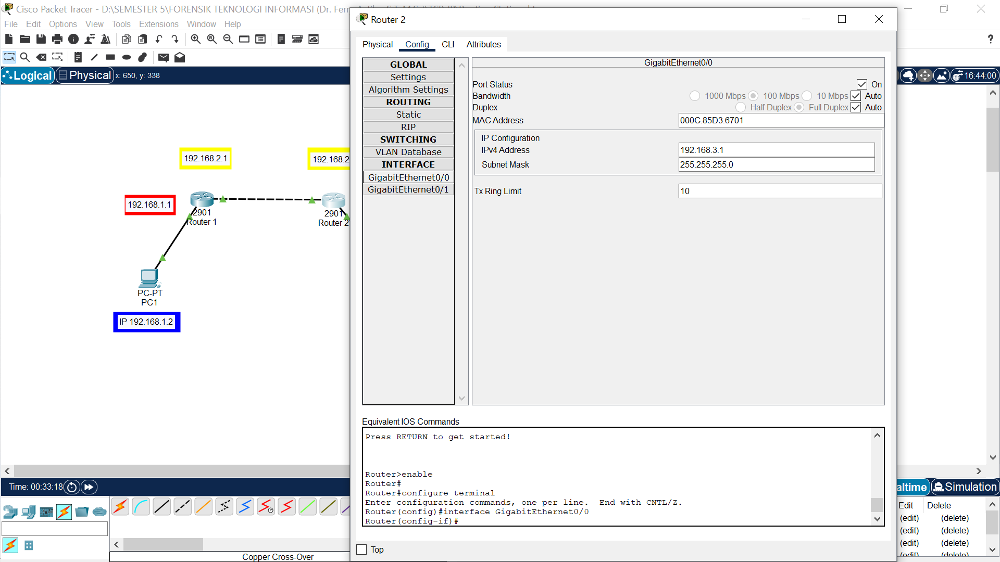

# ⚡ ROUTING STATIS ⚡
## Pengertian
Routing Statis adalah metode konfigurasi rute jaringan dengan cara menentukan jalur paket data secara manual oleh administrator jaringan, bukan otomatis oleh router seperti pada routing dinamis. Metode ini cocok untuk jaringan kecil yang stabil karena administrator dapat memiliki kontrol penuh atas aliran data, namun memerlukan pemeliharaan manual saat ada perubahan topologi jaringan. 
***
## Topologi Jaringan
Berikut adalah topologi jaringan yang digunakan pada simulasi routing statis, 2 PC bisa saling terhubung dengan 2 Router menggunakan Cisco Packet Tracer :

## 1. Hubungkan kabel

PC → Router: Copper Straight-Through (pilih FastEthernet0 di PC, GigabitEthernet0/0 di Router).

Router ↔ Router: Copper Cross-Over (antara G0/1 ↔ G0/1).

Jangan lupa pasang kabel ke port yang sesuai saat diminta Packet Tracer.

## 2. Set IP di PC

Di PC → Desktop → IP Configuration

💻 PC 01

- IP Address: 192.168.1.2

- Subnet Mask: 255.255.255.0

- Default Gateway: 192.168.1.1 (Router 1)

---

💻 PC 02

- IP Address: 192.168.3.2

- Subnet Mask: 255.255.255.0

- Default Gateway: 192.168.3.1

## 3. Konfigurasi PC 1 Dengan Router 1 via Config Tab (GigabitEthernet0/0)

- Klik router → pilih Config → GigabitEthernet0/0

- ✅ Centang On untuk mengaktifkan port.

GigabitEthernet0/0
- IP Address : 192.168.1.1

- Subnet Mask : 255.255.255.0

## 4. Konfigurasi PC 2 Dengan Router 2 via Config Tab (GigabitEthernet0/0)

- Klik router → pilih Config → GigabitEthernet0/0

- ✅ Centang On untuk mengaktifkan port.

GigabitEthernet0/0
- IP Address : 192.168.3.1

- Subnet Mask : 255.255.255.0

## 5. Konfigurasi antara Router 1 dengan Router 2 menggunakan GigabitEthernet0/1

- Klik Router 1 → pilih Config → GigabitEthernet0/1
  
- ✅ Centang On untuk mengaktifkan port.

GigabitEthernet0/1
- IP Address : 192.168.2.1

- Subnet Mask : 255.255.255.0

#Lanjut
- Klik Router 2 → pilih Config → GigabitEthernet0/1
  
- ✅ Centang On untuk mengaktifkan port.

GigabitEthernet0/1
- IP Address : 192.168.2.2

- Subnet Mask : 255.255.255.0

## Sampai sini jaringan sudah saling terhubung dengan ada nya tanda hijau pada masing - masing kabel, namun untuk PC 1 ke PC 2 belom terkonfigurasi. Mari kita lanjutkan !!

## 6. Routing Statis Router 1

## Routing Static Router 1
- Network IP dari PC 2 namun harus diganti berakhiran (.0) dikarenakan harus sama dengan Mask PC 2 (.0)

## 7. Routing Statis Router 2

## Routing Static Router 2
- Network IP dari PC 1 namun harus diganti berakhiran (.0) dikarenakan harus sama dengan Mask PC 2 (.0)

#Pengujian Koneksi#
## Ping PC 1 → PC 2

## Ping PC 2 → PC 1

## Ping Router 1 → Router 2

## Ping Router 2 → Router 1

# Kesimpulan
Routing statis merupakan metode routing yang dilakukan dengan cara mengatur jalur komunikasi jaringan secara manual oleh administrator.  Metode ini sangat cocok digunakan pada jaringan dengan skala kecil hingga menengah karena lebih sederhana, hemat sumber daya, serta memberikan kontrol penuh terhadap aliran data.

Berdasarkan pengujian di atas dapat disimpulkan :
Topologi jaringan ini berhasil menghubungkan dua subnet berbeda (192.168.1.0/24 dan 192.168.3.0/24) menggunakan dua router sebagai perantara.

    • Penerapan Routing Statis pada kedua Router berhasil.
    
    • Pastikan Konfigurasi IP Address, Router interface, Default Gateway dan routing statis sudah benar, sehingga setiap perangkat dapat terhubung pada jaringan.
    
    • Hasil ujicoba dengan ping dari PC 1 ke PC 2 (dan sebaliknya) berhasil dengan baik dengan adanya reply dari alamat tujuan.
    
    • Dengan Konfigurasi Routing Statis komunikasi dapat berjalan lancar dan stabil.
***

Pratu Alfiyan Maulana Samudera
SEKOLAH TINGGI TEKNOLOGI ANGKATAN LAUT
